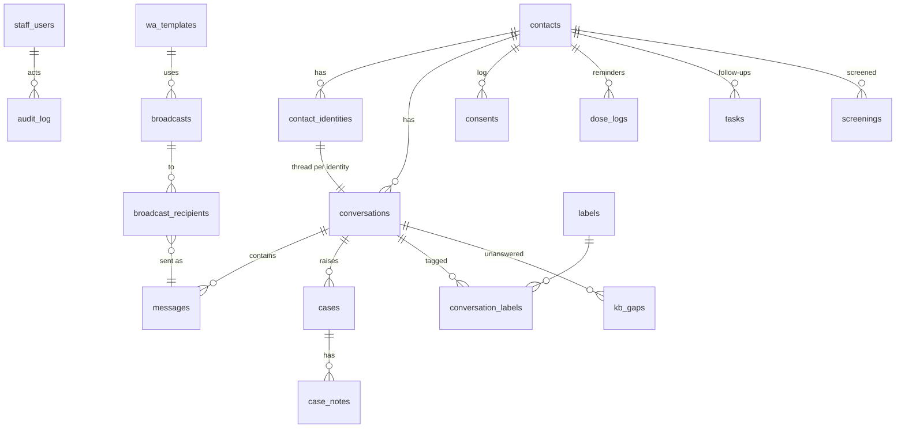

# Architecture

```mermaid
flowchart LR
    subgraph Channels
        WA[WhatsApp Cloud API]
        MS[Messenger]
        IG[Instagram]
        SIM[Simulator page]
    end
    subgraph API["api (FastAPI)"]
        WH["/webhook/{channel}<br/>verify token + HMAC"]
        ADM[admin API<br/>cookie auth, roles, audit]
        SSE["/events (SSE)"]
    end
    subgraph Worker["worker (arq)"]
        PIPE[pipeline per message]
        BC[broadcast sender<br/>rate limit + retries]
    end
    R[(Redis<br/>queue + pub/sub)]
    PG[(PostgreSQL)]
    KB[(KB index<br/>SQLite FTS5 + sqlite-vec)]
    LLM[LLM provider<br/>Groq / Anthropic]
    WEB[web (Next.js)<br/>admin UI]

    WA & MS & IG -->|POST| WH
    SIM --> ADM
    WH -->|enqueue, 200 at once| R
    ADM -->|enqueue| R
    R --> PIPE & BC
    PIPE --> KB
    PIPE --> LLM
    PIPE -->|send via adapter| WA & MS & IG
    BC -->|templates| WA
    PIPE & BC & ADM --> PG
    PIPE & BC & ADM -->|publish| R
    R -->|subscribe| SSE --> WEB
    WEB --> ADM
```

Five containers (`docker compose`): `db` (Postgres 16), `redis`, `api` (uvicorn),
`worker` (arq; same image as `api`), `web` (Next.js standalone).

## Message pipeline (`app/bot/pipeline.py`)

Each inbound message runs as one worker job, under a per-conversation lock so
replies stay in order:

0. **Media** (`app/services/media.py`): files are downloaded right away (WhatsApp
   media ids and Messenger CDN links expire) into `MEDIA_DIR`; voice notes are
   transcribed (`app/services/transcribe.py`: local faster-whisper or Groq) and from
   then on handled like typed text.
1. **Opt-out**: `STOP`/`BERHENTI` (the whole message) → opted out, one
   confirmation, then silence. `MULAI` → back in. An opted-out contact gets no
   replies, but emergency keywords still open a case.
2. **Keyword safety rules** (`config/flags.yaml`, editable in Settings). They are
   free and always run, even over budget or in HUMAN mode.
3. **First contact**: privacy/consent notice.
   - **Screening** (`app/services/screening.py`, BOT mode only): `SKRINING` starts the
     Ya / Tidak questions from `config/screening.yaml`; answers advance it; anything
     else ends it and falls through to the bot.
   - **Reminder answers** (`app/services/reminders.py`): "Sudah" / "Belum" to today's
     medication reminder is recorded and acknowledged.
   - `LANGGANAN` → broadcast consent.
4. **HUMAN mode**: store and notify staff only. A high/emergency keyword still
   opens a case. Outside office hours the contact gets one away message per closed
   period. Non-text messages (photos) get a polite "text only" reply.
5. **Keyword high/emergency**: FIXED safety reply from settings (never
   LLM-generated: IGD / 119 / staff alerted), a case, conversation → HUMAN, a
   badge/toast for staff, and email if SMTP is set (plus the away message at night).
6. **Cost controls**: per-contact rate limit (20 / 10 min) and daily cap (30),
   with a polite notice once. Monthly AI budget: at 80% an alert (once a month); at
   100% either the cheaper classifier model, or a fixed reply + case with no LLM
   call.
7. **LLM classifier** → `{"severity","category","reason"}`. Unreadable output or an
   error counts as `low`. Final severity = max(keyword, classifier); high or above
   goes to step 5.
8. **RAG answer**: retrieve (fixed k) → persona prompt + last 6 messages → LLM
   (≤ 400 output tokens, input ≤ 500 chars) → citation markers stripped → WhatsApp
   formatting → one message ≤ 900 chars. An LLM error sends the fixed
   "staf kami akan menghubungi" reply and opens a low `BOT_ERROR` case. The model
   tags answers the passages don't cover (`[NOINFO]`, stripped); those questions go
   to `kb_gaps` for the Knowledge page.

Scheduled work: the worker runs `reminder_tick` every minute (arq cron): due
medication reminders, follow-ups after N hours without an answer, and escalation
(an ADHERENCE case + a kader task) after N missed days.

## RAG (`rag/` + `app/bot/`)

`rag/` is the retrieval core of the thesis-rag project, vendored with small changes
(see `rag/VENDORED.md`):
- Hybrid search: BM25 (SQLite FTS5) + dense (sqlite-vec), fused with Reciprocal
  Rank Fusion.
- Neighbour expansion.
- Chunks sized in the embedder's own tokens.

The embedder is `intfloat/multilingual-e5-small` (ONNX via fastembed, CPU), so
Indonesian and English questions both find Indonesian passages. The knowledge base
is edited on the Knowledge page and stored in `kb_articles` (the shipped `kb/*.md` are
imported once). **Publish** queues `reindex_kb`: the worker exports published
articles as Markdown to `KB_LIVE_DIR`, `app/bot/kb.py` converts them to the RAG
schema and rebuilds the index (one SQLite file on the `kbdata` volume). Every process
reopens the index when the file changes. `scripts/reindex_kb.py --if-needed` runs at
API start.

## Channels (`app/channels/`)

| Adapter | Inbound | Outbound |
|---|---|---|
| `simulator.py` | admin Simulator page | stored only, shown live |
| `whatsapp.py` | `messages` webhook: text, buttons, media (downloaded via `GET /{media-id}`), statuses | `POST /{phone_number_id}/messages`: text, reply buttons, media (uploaded via `/media`), templates, mark-as-read |
| `meta.py` | Messenger / Instagram `messaging` events, delivery + read watermarks | `POST /{page_id}/messages`, `RESPONSE` or `MESSAGE_TAG`/`HUMAN_AGENT`; quick replies; file upload (Messenger) |

All implement `parse_inbound(payload) -> list[InternalMessage]` and
`send(conversation, text)`, plus `send_buttons`, `send_media` and `download_media`
where the channel supports them. Graph tokens travel in the `Authorization` header,
never in URLs. Webhooks return 200 immediately; a redelivered payload is dropped
by the arq job id and by the unique `messages.external_id`.

## Data model



| Table | Key columns |
|---|---|
| `staff_users` | email, bcrypt hash, role (admin / agent / reviewer), session_epoch, totp_secret / totp_enabled / totp_last_step |
| `contacts` | display_name, phone, notes, opted_out, broadcast_opt_in, journey_stage, treatment_start/months, puskesmas, kader_id, reminder_enabled/time |
| `contact_identities` | channel, external_id (unique per channel), simulated |
| `conversations` | channel, status OPEN/RESOLVED, mode BOT/HUMAN, assigned_to, window_expires_at, flag_severity, away_sent_at |
| `messages` | direction in/out/note, sender_type user/bot/agent/system, text, media_url, external_id (unique), status, flag_severity/category/reason, tokens_in/out, cost_idr, meta |
| `cases` / `case_notes` | severity, category, status OPEN/CLAIMED/RESOLVED, assigned_to, trigger message |
| `consents` | append-only: privacy_notice / messaging / broadcast × notified / granted / revoked, source |
| `settings` | key → JSON overrides of the defaults in `app/services/settings_service.py` |
| `llm_usage` | provider, model, purpose, tokens, cost (USD + IDR), latency, ok/error |
| `audit_log` | actor, action, entity, details, ip |
| `wa_templates`, `broadcasts`, `broadcast_recipients` | template body/variables; campaign; per-recipient status and attempts |
| `saved_replies`, `labels`, `conversation_labels` | `/` shortcuts; conversation tags |
| `kb_articles`, `kb_gaps` | knowledge-base articles (doc_id cited as the source); unanswered questions |
| `dose_logs` | one reminder per contact per local day: pending / taken / missed / skipped, follow-up sent |
| `tasks` | call / visit / other, due date, assignee, status, outcome, source (staff / missed_doses / screening) |
| `screenings` | screening session: step, answers, result presumptive / negative |

Migrations: `alembic/versions/0001..0009`.

## Security notes

- Staff sessions: signed, httponly, SameSite=Lax cookie (`itsdangerous`, 12 h).
  `session_epoch` invalidates sessions on password change or deactivation. Failed
  logins (and wrong 2FA codes) are rate-limited per IP.
- Optional two-step verification (TOTP, `app/totp.py`): ±1 step for clock drift, a
  used step can't be reused; admins can reset it for someone who lost their phone.
- Media files are served only to signed-in staff, by random name; uploads are
  limited to known types and sizes.
- CSV exports (personal data) are admin/reviewer only and audited.
- CSRF: an Origin check on state-changing requests, CORS limited to `WEB_BASE_URL`.
- Every admin route requires auth (test enumerates the OpenAPI routes). Roles:
  reviewers are read-only; settings and broadcasts are admin-only.
- Audit: logins, conversation views, replies, mode/status changes, case actions,
  settings, merges, consents, broadcasts.
- Secrets live only in `.env`. A logging filter replaces any configured secret
  value with `***`.

## Not production-ready yet

- Prototype: test data only (noted on the sign-in page).
- The KB content, the fixed safety texts, the screening questions and the reminder
  texts need clinical review.
- One API process and an in-process login limiter. Backups and HTTPS exist
  ([HOSTING.md](HOSTING.md)) but haven't run on a real server yet; backups need an
  off-site copy.
- WhatsApp pricing figures are editable estimates; Meta's pricing model changed in
  2024–2025.
